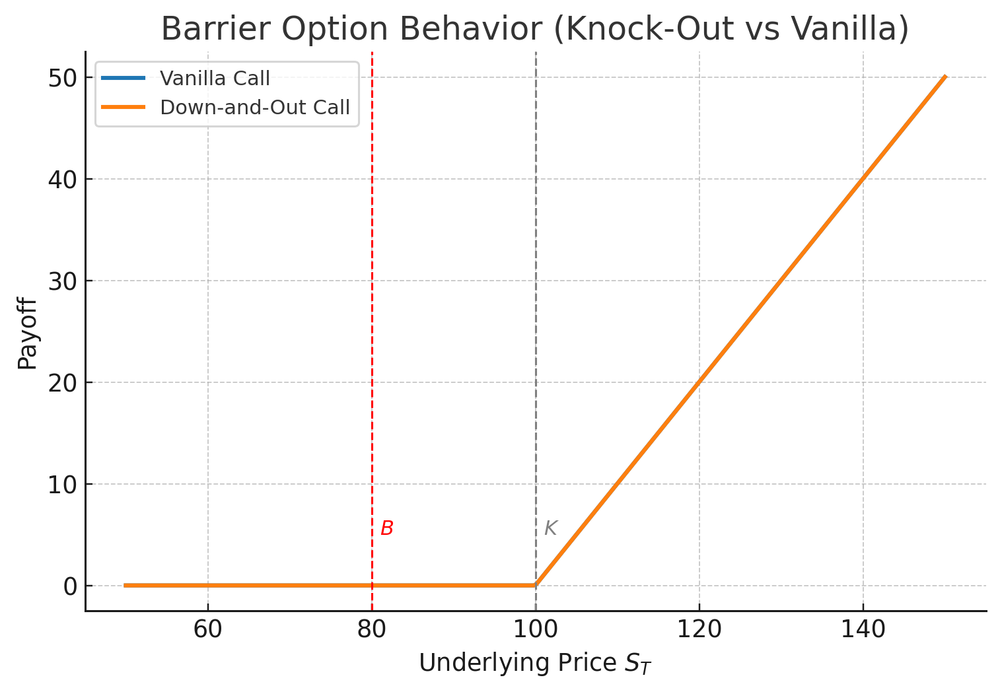
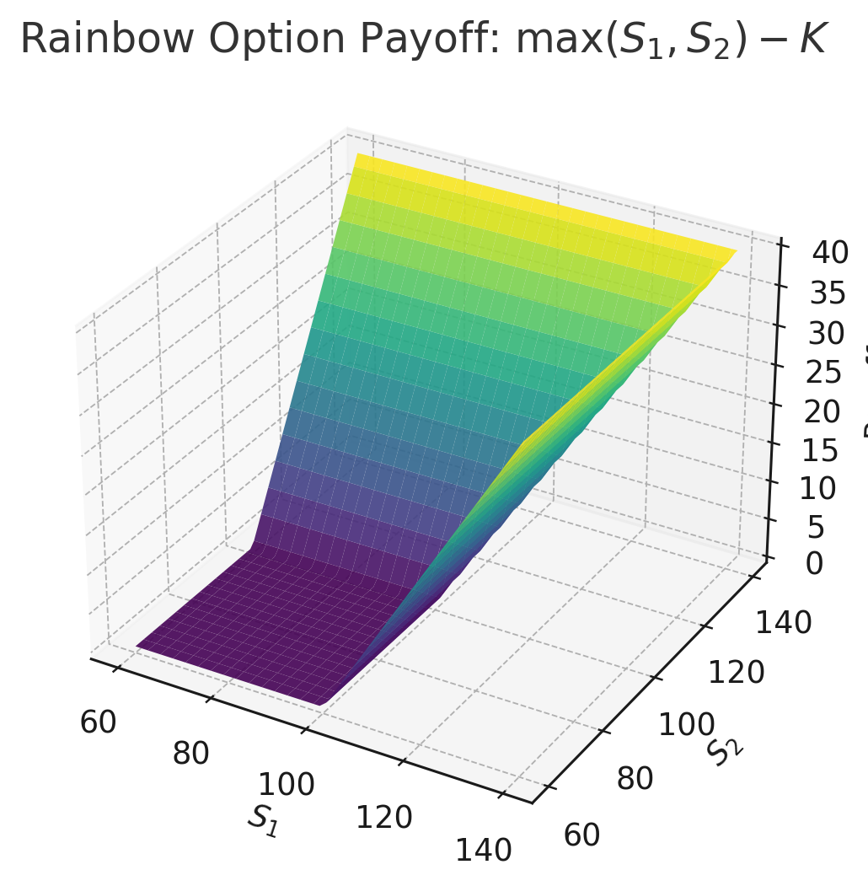

**Exotic options** extend beyond standard European calls and puts by modifying payoffs, paths, or conditions of exercise.  
They tailor exposure to specific market views or hedging needs and are widely traded in FX, equities, commodities, and structured products.

## Why Exotic Options Exist

Vanilla options only depend on $S_T$, the terminal price.  
In practice, clients often need exposure to **path-dependent**, **barrier**, or **average-based** outcomes.

Exotics provide:

- Cost-efficient hedging (e.g., barrier options cheaper than vanilla).  
- Targeted payoff customization (e.g., range accrual, lookback).  
- Tailored risk-transfer (structured notes, callable yield enhancement).

However, these benefits come with **model risk** and **liquidity risk**.

## Classification Overview

| Type | Example | Key Feature |
|------|----------|-------------|
| **Path-dependent** | Asian, Lookback | Depends on price history |
| **Barrier** | Knock-in / Knock-out | Activated or extinguished by crossing a level |
| **Digital / Binary** | Cash-or-nothing | Discrete payoff trigger |
| **Compound** | Call on a call | Option on another option |
| **Chooser / Switch** | Pick call or put later | Embedded flexibility |
| **Rainbow / Multi-asset** | Max(S₁, S₂), Spread | Correlation exposure |
| **Cliquet / Ratchet** | Reset gains | Accumulated periodic performance |

## Path-Dependent Options

### Asian (Average-Price or Average-Strike)

Payoff depends on the **average** of the underlying price over time:
$$
A_T=\frac{1}{n}\sum_{i=1}^n S_{t_i},\quad
\text{Payoff}= \max(A_T - K,0).
$$
Reduces sensitivity to spikes → lower volatility exposure → cheaper price.

### Lookback Options

Payoff depends on the **max or min** achieved:
$$
\text{Call: } V_T=S_{\max}-K,\qquad
\text{Put: } V_T=K-S_{\min}.
$$
Provides “perfect timing” — highest convexity, expensive premium.

## Barrier Options

### Definition

Barriers introduce activation (knock-in) or extinction (knock-out) conditions:

- **Up-and-in / Up-and-out**
- **Down-and-in / Down-and-out**

Payoff occurs only if the barrier $B$ is breached (or not) during life:
$$
V_T^{UO}=1_{\{\max_t S_t < B\}}\max(S_T-K,0).
$$

### Pricing Intuition

- Knock-out options are **cheaper** than vanilla (less likely to survive).  
- Knock-in + Knock-out = Vanilla (static replication).  
- Analytic formulas exist under BSM via **reflection principle**.

### Example

A **down-and-out call** at $K=100$, $B=80$ may cost 60% of the vanilla call — cheaper hedge if you expect the stock to stay above $80$.

## Digital and Binary Options

Digital options pay a fixed amount if a condition is met:
$$
\text{Cash-or-nothing call: } V_T =
\begin{cases}
Q, & S_T > K, \\
0, & S_T \le K.
\end{cases}
$$

The **BSM price** under risk-neutral measure:
$$
C_{\text{digital}} = e^{-rT} N(d_2).
$$

Applications:

- Credit derivatives (digital triggers).  
- FX options for yield enhancement.

## Multi-Asset (Rainbow, Basket, Spread)

These depend on several assets:

- **Rainbow call:** $\max(S_1,S_2)-K$
- **Spread:** $(S_1 - S_2 - K)^+$
- **Basket:** $(w_1 S_1 + w_2 S_2 - K)^+$

Pricing requires **joint distribution** modeling — correlations and volatilities critical.  
Monte Carlo and copula-based methods are standard tools.

## Cliquet and Ratchet Options

Cliquet options **reset** each period, locking in gains:
$$
V_T = \sum_{i=1}^n \max(S_{t_i}/S_{t_{i-1}}-1,0).
$$

Used in equity-linked notes to provide participation in cumulative positive returns with downside protection.

## Exotic Option Pricing Methods

| Method | Use Case | Notes |
|---------|-----------|-------|
| **Analytic (closed-form)** | Simple barriers, binaries | Reflection principle, Laplace transforms |
| **Tree methods** | Early-exercise features | Efficient for small dimensions |
| **Monte Carlo** | Path-dependent, multi-asset | Flexible, slow convergence |
| **PDE methods** | Local vol models | Finite-difference schemes, good for barriers |

Variance reduction (antithetic, control variates) improves Monte Carlo efficiency.

## Risk and Hedging Considerations

- **Path-dependence risk:** Standard Greeks insufficient; rely on simulation Greeks (bump-and-revalue, adjoint differentiation).  
- **Vega/Gamma risk:** Often nonlinear; small vol moves cause large price jumps (especially near barrier).  
- **Correlation risk:** For multi-asset exotics, mis-specifying $\rho$ severely impacts valuation.  
- **Model risk:** Choice between local/stochastic vol or jump-diffusion changes hedging P&L significantly.  
- **Liquidity risk:** OTC exotics trade in thin markets — wide bid–ask spreads, large valuation adjustments (XVA).

## Summary

- Exotics customize payoff structures for risk management, yield, or exposure.  
- Their valuation requires **advanced models** and careful **hedging of path-dependent risks**.  
- Most can be decomposed into portfolios of vanillas — enabling static or semi-static hedges.  
- Practical understanding requires both modeling and market structure expertise.
