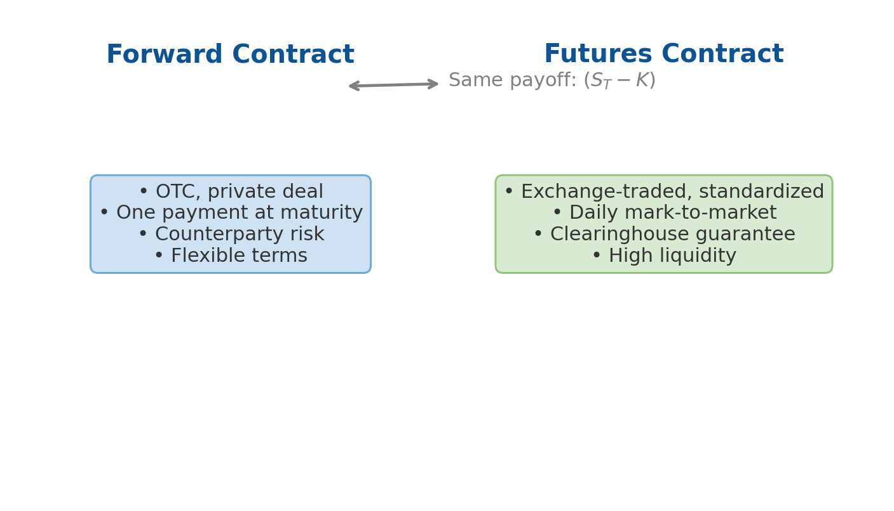
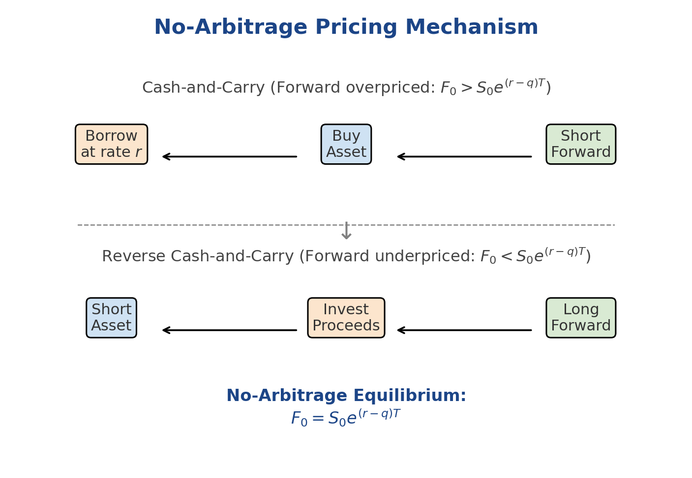

Among all derivatives, **forwards** and **futures** are the simplest.  
They are *linear* contracts whose payoffs vary one-for-one with the underlying price.  
Understanding their pricing through the lens of **no-arbitrage** provides the mathematical foundation for all derivative valuation.

## 1. What Are Forwards and Futures?

### Forward Contract

A **forward** is a private OTC agreement to exchange an asset at a fixed price $K$ on a future date $T$.

- **Long forward:** commits to buy at $K$.  
- **Short forward:** commits to sell at $K$.  

At maturity, the long receives:

$$
\Pi_T = S_T - K.
$$

### Futures Contract

A **futures** contract is the exchange-traded equivalent:

- standardized contract size and expiry,
- daily mark-to-market settlement through a clearinghouse,
- margin requirements that limit credit exposure.

## 2. The No-Arbitrage Pricing Principle

Pricing of forwards and futures rests on the idea that **identical future payoffs must cost the same today**.

Assume:

- Current spot price of the asset: $S_0$
- Continuous risk-free rate: $r$
- Continuous yield on the asset (dividend, foreign interest, or convenience yield): $q$
- Time to maturity: $T$

We construct **replicating portfolios** to enforce price consistency.

---

### 2.1 Cash-and-Carry Arbitrage

Imagine the forward is **over-priced** ($F_0 > S_0 e^{(r - q)T}$).  
We can lock in risk-free profit via a *cash-and-carry* strategy:

1. **Borrow** $S_0$ cash at rate $r$.
2. **Buy** one unit of the underlying asset at $S_0$.
3. **Short** one forward at price $F_0$ (agree to sell later).

At maturity $T$:

- Deliver the asset into the forward and receive $F_0$.
- Repay the loan $S_0 e^{rT}$.
- Receive any income (dividends or yield) of $S_0(e^{qT}-1)$.

The total terminal payoff:

$$
\text{Profit} = F_0 - S_0 e^{(r - q)T}.
$$

If $F_0$ is indeed higher than $S_0 e^{(r - q)T}$, this profit is positive and **arbitrage** exists.  
Competition pushes $F_0$ down until equality holds.

### 2.2 Reverse Cash-and-Carry Arbitrage

Conversely, if the forward is **under-priced** ($F_0 < S_0 e^{(r - q)T}$):

1. **Short sell** one unit of the underlying at $S_0$.  
2. **Invest** the proceeds at rate $r$.  
3. **Go long** one forward at $F_0$ (agree to buy later).

At $T$:

- Buy back the asset via the forward for $F_0$.  
- Collect the matured investment $S_0 e^{rT}$.  
- Pay any carry cost or yield $S_0(e^{qT}-1)$.

The payoff is:

$$
\text{Profit} = S_0 e^{(r - q)T} - F_0.
$$

If positive, arbitrageurs buy forwards and short spot, driving prices back to parity.

### 2.3 Equilibrium Relation

In equilibrium (no free lunch), both strategies yield zero profit:

$$
F_0 = S_0 e^{(r - q)T}.
$$

This is the **cost-of-carry model** — the cornerstone of forward and futures pricing.

---

### 2.4 Example: Equity Forward on a Dividend-Paying Stock

Suppose:

- Current stock price $S_0 = 100$  
- Annual risk-free rate $r = 5\%$  
- Continuous dividend yield $q = 2\%$  
- Maturity $T = 0.5$ years

Then

$$
F_0 = 100\, e^{(r - q)T}
     = 100\, e^{(0.05 - 0.02)\times0.5}
     = 101.51.
$$

#### Arbitrage Intuition

If a forward were quoted at $F_0 = 103$:

- You would **short the forward**, **buy the stock**, and **borrow** \$100.
- In 6 months:  
  receive $103$, repay $100 e^{0.05\times0.5}=102.53$, receive dividends ≈ \$1.  
- Net profit ≈ \$1.47 risk-free → arbitrage.

### 2.5 Visualization

The diagram illustrates how arbitrage connects **spot**, **carry**, and **forward** value:  
if the forward is too high → cash-and-carry (sell forward, buy spot);  
too low → reverse cash-and-carry (buy forward, sell spot).

## 3. Futures Pricing and Convexity

For deterministic interest rates, futures and forwards have the same fair value.  
However, with stochastic rates:

$$
E_t[F_T] \ne F_t,
$$

because futures are marked to market daily.  
If $\text{corr}(r_t, S_t) > 0$, the long futures tends to outperform the forward — a **positive convexity bias**.

## 4. Market Usage

| Sector | Purpose | Typical Instrument |
|--------|----------|--------------------|
| **Corporates** | Hedge commodity or FX exposure | Oil futures, FX forwards |
| **Investors** | Adjust equity exposure | Index futures |
| **Banks** | Construct forward rate curves | FRA, Eurodollar futures |
| **Hedge funds** | Relative-value arbitrage | Calendar spreads |

These instruments underpin price discovery across asset classes.

## 5. Summary

- No-arbitrage ensures $F_0 = S_0 e^{(r - q)T}$.  
- Cash-and-carry and reverse carry strategies enforce this relation.  
- Forwards and futures bridge present and future market prices.  
- Small deviations signal funding or collateral effects rather than arbitrage.

Next up: [Options: Basics and Put–Call Parity](options-basics.md)
