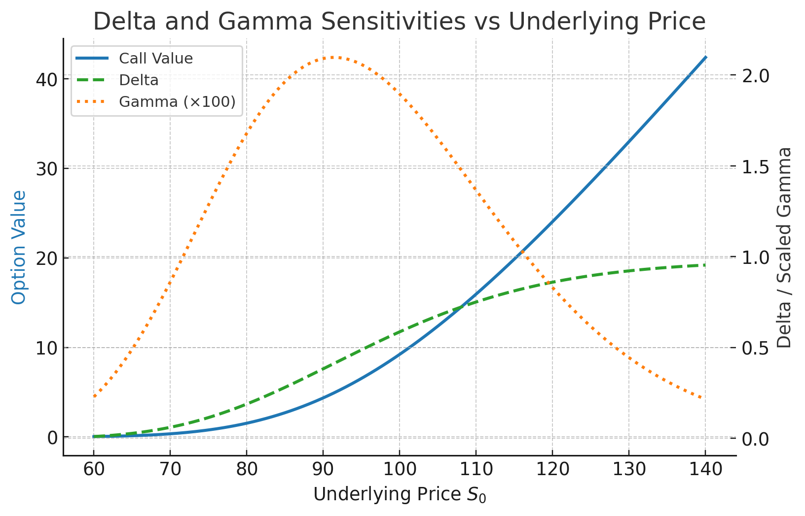
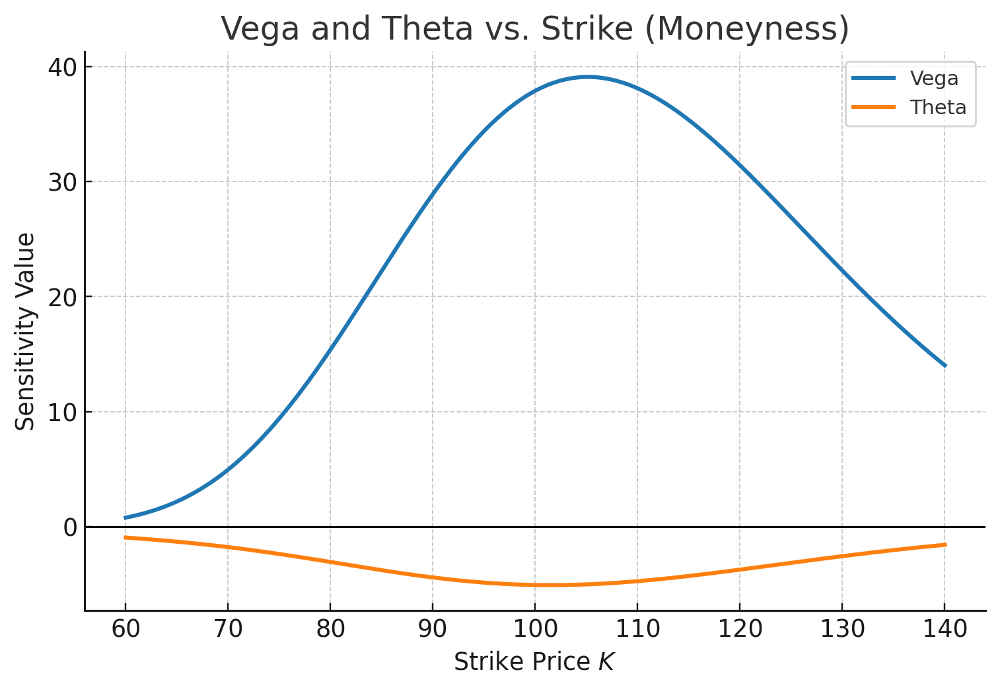

The **Greeks** are the sensitivities of an option’s value to changes in underlying variables.  
They quantify how price, volatility, time, and interest rates affect an option’s value — the foundation of risk management and hedging.

## 1. Overview of Greeks

| Greek | Symbol | Definition | Interpretation |
|--------|---------|-------------|----------------|
| **Delta** | $\Delta = \frac{\partial V}{\partial S}$ | Change in value for small move in $S$ | Hedge ratio (shares per option) |
| **Gamma** | $\Gamma = \frac{\partial^2 V}{\partial S^2}$ | Curvature of value wrt $S$ | Convexity of option value |
| **Vega** | $\nu = \frac{\partial V}{\partial \sigma}$ | Sensitivity to volatility | Exposure to implied vol changes |
| **Theta** | $\Theta = \frac{\partial V}{\partial t}$ | Sensitivity to time decay | Daily erosion of time value |
| **Rho** | $\rho = \frac{\partial V}{\partial r}$ | Sensitivity to interest rate | Rate exposure |
| **Phi** | $\phi = \frac{\partial V}{\partial q}$ | Sensitivity to dividend yield | Dividend exposure |

## 2. Delta — Directional Sensitivity

For a European call under Black–Scholes:

$$
\Delta_{call} = e^{-qT} N(d_1), \qquad
\Delta_{put} = e^{-qT} (N(d_1) - 1).
$$

- $\Delta_{call}$ ranges from 0 → 1.  
- $\Delta_{put}$ ranges from -1 → 0.

### Interpretation

- Delta ≈ number of shares needed to hedge one option.  
- Example: $\Delta = 0.6$ means you buy 0.6 shares per short call to be **delta-neutral**.

## 3. Gamma — Convexity and Delta Stability

$$
\Gamma = e^{-qT}\frac{N'(d_1)}{S_0\sigma\sqrt{T}}.
$$

- Measures how fast delta changes with $S$.  
- High near-the-money, low deep ITM/OTM.  
- Gamma determines the **hedging frequency** required to remain delta-neutral.

Gamma is positive for both long calls and long puts — long options **benefit from volatility** because they are convex.

## 4. Vega — Volatility Sensitivity

$$
\nu = S_0 e^{-qT} N'(d_1)\sqrt{T}.
$$

- Measures change in option value per 1% change in volatility.  
- Largest for ATM, long-dated options.  
- Traders use **Vega-neutral** portfolios to isolate volatility trading from directional moves.

## 5. Theta — Time Decay

$$
\Theta = -\frac{S_0 e^{-qT} N'(d_1)\sigma}{2\sqrt{T}} - r K e^{-rT} N(d_2) + q S_0 e^{-qT} N(d_1).
$$

- Typically negative for long calls and puts — time decay erodes value.  
- Positive theta occurs in short option positions (income strategies).  
- Time decay accelerates as expiration approaches.

## 6. Rho and Phi — Rate and Dividend Exposure

$$
\rho_{call} = K T e^{-rT} N(d_2), \qquad
\rho_{put} = -K T e^{-rT} N(-d_2).
$$

$$
\phi_{call} = -T S_0 e^{-qT} N(d_1), \qquad
\phi_{put} = T S_0 e^{-qT} N(-d_1).
$$

Interest rates and dividends matter primarily for long-dated or high-yield assets.

## 7. Higher-Order Greeks (optional)

| Symbol | Name | Description |
|---------|------|-------------|
| $\text{Vanna}$ | $\frac{\partial^2 V}{\partial S \partial \sigma}$ | How delta changes with volatility |
| $\text{Vomma}$ | $\frac{\partial^2 V}{\partial \sigma^2}$ | Curvature wrt volatility (volga) |
| $\text{Charm}$ | $\frac{\partial \Delta}{\partial t}$ | Time decay of delta |
| $\text{Color}$ | $\frac{\partial \Gamma}{\partial t}$ | Time decay of gamma |

These are used in advanced risk management systems.

## 8. Risk Management and Hedging

### 8.1 Delta Hedging

A **delta-hedged portfolio** offsets price risk:

$$
\Pi = V - \Delta S.
$$

Regularly rebalance $\Delta$ to remain neutral.  
However, imperfect hedging introduces **gamma and theta** risk — known as **Gamma–Theta tradeoff**.

### 8.2 Gamma–Theta Tradeoff

- Long Gamma → benefits from volatility but loses to time decay.  
- Short Gamma → earns Theta but loses from large price swings.

Market makers dynamically manage this tradeoff through **delta–gamma hedging**.

### 8.3 Vega Hedging

To hedge volatility exposure, hold an opposite Vega position — for example, long ATM calls and short OTM calls.  
Complex portfolios are constructed to remain **delta–vega–theta neutral** at the book level.

### 8.4 Portfolio Greeks

In a portfolio of $n$ options:

$$
\Delta_P = \sum_i \Delta_i Q_i, \quad
\Gamma_P = \sum_i \Gamma_i Q_i, \quad
\nu_P = \sum_i \nu_i Q_i, \dots
$$

These aggregate Greeks form the basis of **risk limits** and **scenario stress testing**.

## 9. Visualization: Greek Sensitivities

## 10. Summary

- The Greeks quantify directional, curvature, volatility, time, and rate sensitivities.  
- They enable hedging, risk control, and capital allocation.  
- Real-world traders manage entire portfolios through **Greek neutrality**.  
- The balance between Gamma and Theta defines most market-making behavior.

Next up: [Volatility Surface and Smile](volatility-surface-and-smile.md)
