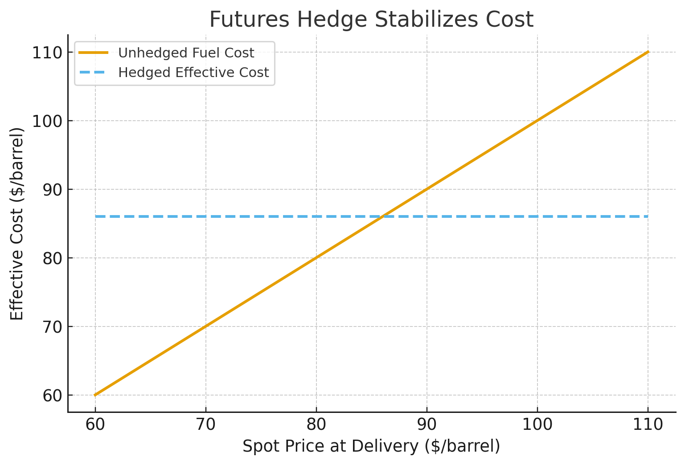

Financial derivatives are contracts whose value depends on an underlying asset, rate, or index.  
They are the **building blocks of modern financial markets**, used for risk management, speculation, and price discovery.

## What Are Derivatives?

A derivative does not represent ownership of an asset itself — instead, it defines a contractual relationship **based on the performance of another variable** such as:

- Stock price (e.g., options on Apple shares)  
- Interest rate (e.g., swaps, caps, floors)  
- Currency exchange rate (e.g., FX forwards)  
- Commodity price (e.g., oil, gold futures)  
- Market index or volatility (e.g., S&P 500 options, VIX futures)

In short, derivatives are *financial engineering tools* that allow exposure to an asset without directly holding it.

## Why Are Derivatives Important?

1. **Risk Management (Hedging)**  
   Derivatives allow companies and investors to protect themselves from adverse price movements.  
   - An airline can hedge against rising jet-fuel prices using oil futures.  
   - An exporter can lock in exchange rates using FX forwards.  
   - A bondholder can hedge interest-rate risk with swaps or options on Treasury futures.

2. **Speculation and Leverage**  
   Traders can take leveraged positions to express directional or volatility views.  
   - Buying a call option provides upside exposure with limited downside.  
   - Shorting volatility through options strategies can generate yield in stable markets.

3. **Arbitrage and Market Efficiency**  
   Professional traders exploit pricing differences between related instruments — ensuring **no-arbitrage relationships** such as put–call parity and cash-and-carry consistency.

4. **Customization and Financial Innovation**  
   Derivatives can be structured to replicate complex payoffs, support structured products, or manage portfolio risk precisely.

## Real-World Scale and Participants

The global derivatives market is vast — with notional outstanding in the **hundreds of trillions of USD**, spanning both exchange-traded and over-the-counter (OTC) products.

| Segment | Typical Instruments | Where Traded |
|----------|--------------------|---------------|
| **Exchange-Traded** | Futures, options | CME, ICE, Eurex, HKEX |
| **OTC Markets** | Swaps, forwards, exotic options | Interbank / bilateral |
| **Clearinghouses** | CCPs manage counterparty risk | LCH, CME Clearing |

Key participants include:

- **Corporates:** hedge revenues and costs  
- **Institutional investors:** manage portfolio risk and duration  
- **Banks:** provide liquidity, market-making, and structuring  
- **Hedge funds / prop traders:** exploit inefficiencies  
- **Regulators and clearinghouses:** ensure transparency and systemic stability

## When and Why Derivatives Matter

The use and pricing of derivatives depend heavily on **market conditions**:

| Market Environment | Typical Derivative Use | Example |
|--------------------|-----------------------|----------|
| Rising volatility | Buy protective puts, trade VIX futures | Portfolio insurance |
| Falling rates | Pay fixed in interest-rate swaps | Duration management |
| Strong dollar | Hedge foreign revenue via FX forwards | Exporter risk hedge |
| Commodity shocks | Lock input costs with futures | Airline fuel hedging |
| Calm equity markets | Sell options to earn premium | Volatility harvesting |

Derivatives are thus *state-contingent instruments* — their appeal and payoff depend on expectations of future market behavior.

## Example: Using Futures to Hedge Price Risk

Suppose an airline expects to buy **1 million barrels of jet fuel** in three months.  
Current price is \$85/barrel, but management fears an increase.  
By **buying oil futures** at \$86/barrel on the CME, the airline locks in its future cost:

- If spot rises to \$95 → futures gain offsets higher cost.  
- If spot falls to \$80 → hedge loses, but fuel is cheaper.

This simple transaction stabilizes budgeting and removes price uncertainty — demonstrating the practical role of derivatives.

## Key Takeaways

- Derivatives transfer risk rather than eliminate it.  
- Their value derives from the behavior of underlying assets.  
- They link cash and futures markets, anchoring prices via arbitrage.  
- Understanding derivatives is essential for risk management, trading, and quantitative modeling.

Next up: [Forwards & Futures](forwards-and-futures.md)
