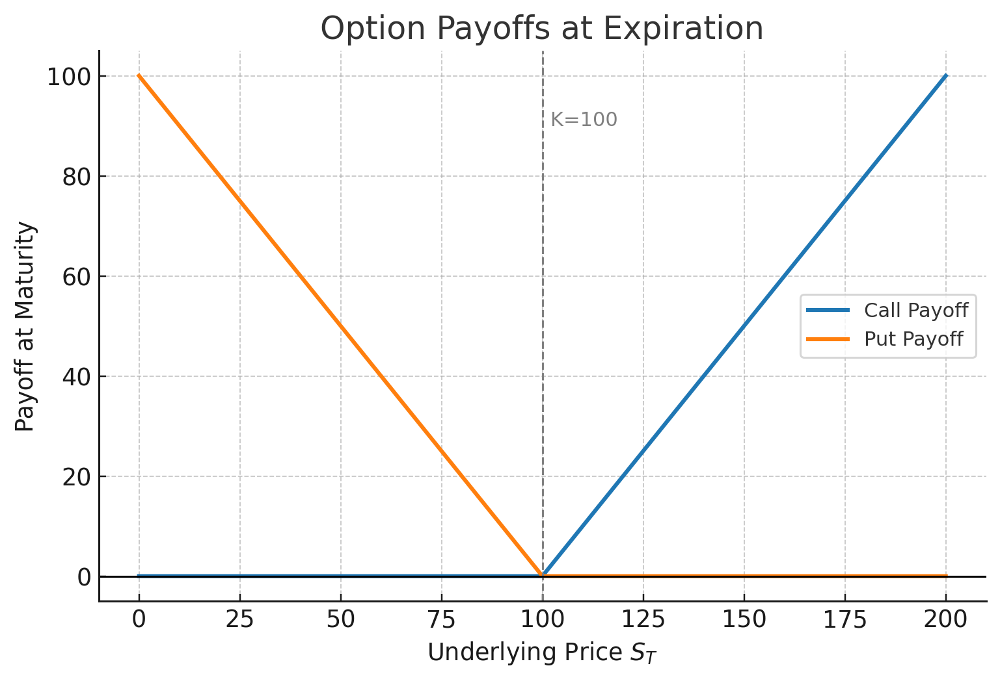
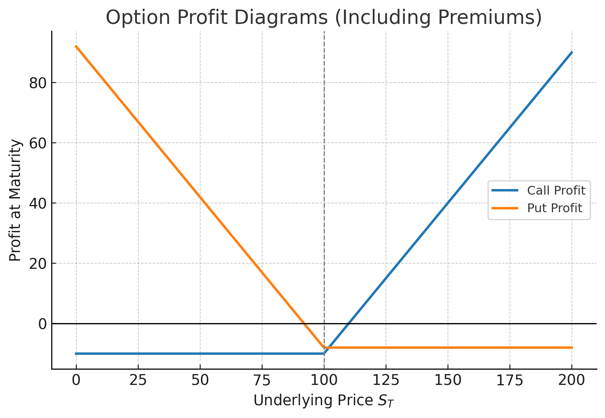
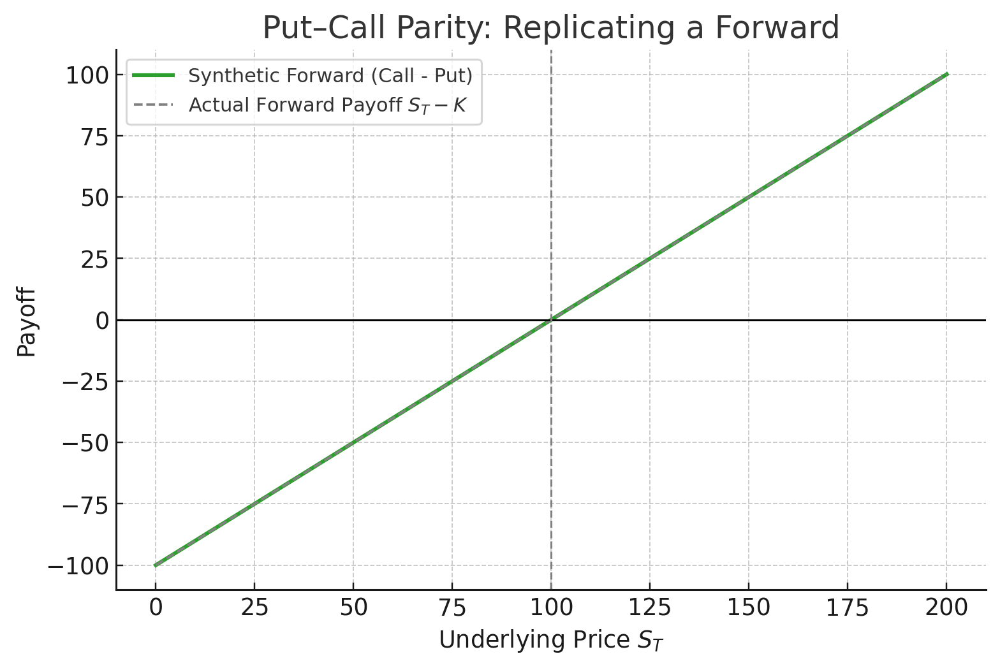

Options are the most widely known class of derivatives.  
Unlike forwards and futures — which **obligate** both parties — an option grants **rights** but not obligations.  
This asymmetry makes option pricing and hedging central to modern quantitative finance.

## 1. What Is an Option?

An **option** is a contract giving its holder the right, but not the obligation, to **buy or sell** an underlying asset at a predetermined price (the **strike**, $K$) before or at a specified date (the **maturity**, $T$).

| Type | Action | Right to | Payoff at Maturity |
|------|---------|----------|--------------------|
| **Call** | Buy | $S_T$ | $\max(S_T - K, 0)$ |
| **Put** | Sell | $S_T$ | $\max(K - S_T, 0)$ |

Key parameters:

- $S_T$: price of the underlying at expiry  
- $K$: strike price  
- $T$: time to expiration  
- $r$: risk-free rate  
- $q$: continuous yield or dividend rate  

## 2. Economic Meaning

Options introduce **nonlinear exposure**:

- A **call** provides upside participation with limited downside.  
- A **put** provides downside protection.  

These features make options valuable tools for both **hedging** and **speculation**.

### Hedging Example

An investor holding a stock can buy a put to protect against large losses — creating a *protective put* position that behaves like insurance.

### Speculative Example

A trader expecting volatility can buy both a call and a put (a *straddle*).  
If the market moves significantly in either direction, the combined position profits.

## 3. Payoff and Profit

The option **payoff** is the cash flow at expiry, while **profit** accounts for the premium paid ($C_0$ or $P_0$).

| Option | Payoff | Profit |
|--------|---------|---------|
| Call | $\max(S_T - K, 0)$ | $\max(S_T - K, 0) - C_0$ |
| Put | $\max(K - S_T, 0)$ | $\max(K - S_T, 0) - P_0$ |

The point where profit crosses zero is the **break-even price**:

- Call: $S_T = K + C_0$  
- Put: $S_T = K - P_0$

## 4. Moneyness and Intuition

The relationship between $S_T$ and $K$ determines the **moneyness** of an option:

| Condition | Call Option | Put Option |
|------------|--------------|-------------|
| $S_T > K$ | In the Money (ITM) | Out of the Money (OTM) |
| $S_T = K$ | At the Money (ATM) | At the Money (ATM) |
| $S_T < K$ | Out of the Money (OTM) | In the Money (ITM) |

Moneyness affects both the option’s **intrinsic value** and **time value**:
$$
\text{Option Premium} = \text{Intrinsic Value} + \text{Time Value.}
$$

## 5. European vs. American Exercise

- **European options** can be exercised only at expiration ($T$).  
- **American options** can be exercised anytime up to $T$.  

For non-dividend-paying assets, an American call is **never optimal to exercise early** because holding preserves time value.  
However, for puts or dividend-paying assets, early exercise can be rational.

## 6. Put–Call Parity

A cornerstone relation linking calls, puts, and forwards is **Put–Call Parity**.  
It arises from the equality of two portfolios with identical payoffs.

### Portfolios

| Portfolio | Composition | Payoff at $T$ |
|------------|-------------|---------------|
| A | Long Call + Short Put | $S_T - K$ |
| B | Long Forward (deliver at $K$) | $S_T - K$ |

Since both have the same payoff, their current values must be equal:

$$
C_0 - P_0 = S_0 e^{-qT} - K e^{-rT}.
$$

If this equality fails, arbitrage exists:

- If LHS > RHS → short (Call–Put combo), long (synthetic forward).  
- If LHS < RHS → opposite trade.

## 7. Practical Applications

1. **Synthetic Positions:**  
   Build one asset’s payoff using others:  
   - Long Call + Short Put = Synthetic Forward  
   - Long Stock + Long Put = Protective Put  
   - Short Stock + Long Call = Synthetic Put

2. **Hedging and Risk Management:**  
   - Portfolio insurance using index puts.  
   - Option collars for downside protection with capped upside.

3. **Volatility Trading:**  
   - Long straddle or strangle for volatility exposure.  
   - Short variance swaps or options for income generation.

## 8. "Price" vs "Intrinsic Value"

- **Price** is the market value of the option, determined by supply and demand.
  - Also called **premium**.
  - We could see it as the how much the "right" is worth today, the "right" including exercise value and the time value.
- **Intrinsic Value** is the immediate exercise value:
  - Call: $\max(S_T - K, 0)$
  - Put: $\max(K - S_T, 0)$
  - This is immediate exercise value, ignoring time value.
- **Time Value** is the extra amount paid over intrinsic value, reflecting the probability of future favorable movements.

## 9. Summary

- Options give asymmetric rights, not symmetric obligations.  
- Payoff nonlinearity introduces convex exposure to price and volatility.  
- Put–Call parity links option prices to forward values and ensures arbitrage-free pricing.  
- Understanding payoffs and parity prepares you for the next step: **the Binomial Model**, where we build discrete-time option pricing intuition.

Next up: [Options Pricing: Binomial Model](options-pricing-binomial-model.md)
