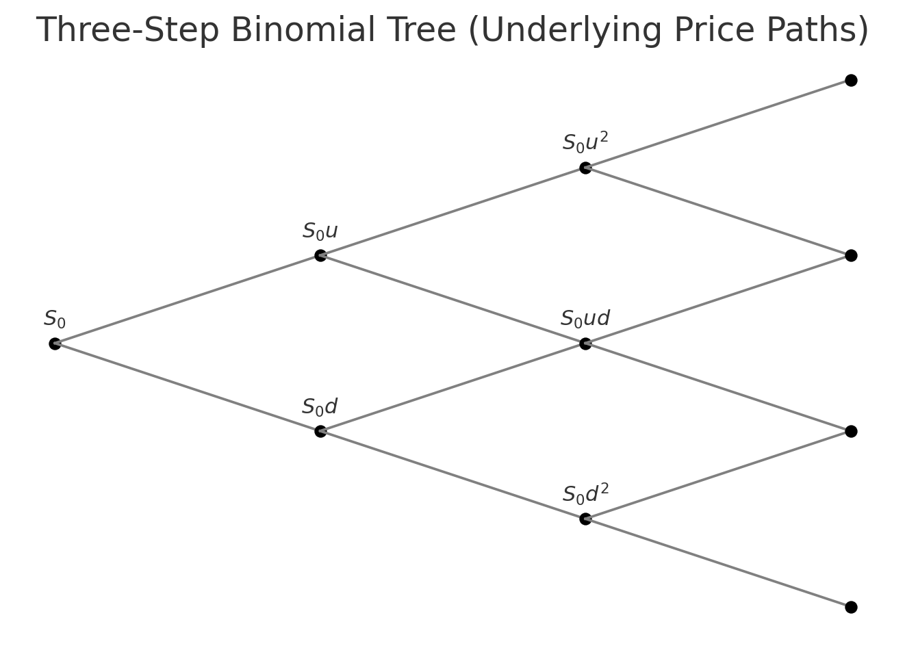

The **binomial model** is the most intuitive and fundamental method for option pricing.  
It provides a discrete-time framework for valuing derivatives by replicating their payoffs with dynamic trading in the underlying and a risk-free asset.

## 1. Conceptual Overview

In a single period of length $\Delta t$, the underlying price can move **up** or **down** by known factors:

$$
S_u = S_0 u, \quad S_d = S_0 d,
$$

where $u > 1$ and $d < 1$.  
At maturity, the option’s payoff is $V_u = f(S_u)$ or $V_d = f(S_d)$.

The model assumes frictionless trading, continuous compounding at rate $r$, and the ability to borrow and short-sell.

## 2. Building the Replicating Portfolio

We replicate the option by holding $\Delta$ shares of the underlying and investing $B$ in the risk-free asset:

$$
\begin{cases}
\Delta S_u + B e^{r\Delta t} = V_u, \\\\
\Delta S_d + B e^{r\Delta t} = V_d.
\end{cases}
$$

Solving for $\Delta$ and $B$ gives:

$$
\Delta = \frac{V_u - V_d}{S_0(u - d)}, \qquad
B = e^{-r\Delta t}\frac{uV_d - dV_u}{u - d}.
$$

The **current option value** is then

$$
V_0 = \Delta S_0 + B.
$$

## 3. Risk-Neutral Valuation

Alternatively, define the **risk-neutral probability** $p^*$ as the probability that makes the expected growth of the asset equal to the risk-free rate:

$$
p^* = \frac{e^{(r - q)\Delta t} - d}{u - d}.
$$

Then the option’s current value can be written compactly as the discounted expectation under this measure:

$$
V_0 = e^{-r\Delta t}\left[p^* V_u + (1 - p^*)V_d\right].
$$

This discrete-time expectation is the **foundation** of all modern risk-neutral pricing.

## 4. Multi-Step Tree

Extending to $N$ time steps ($T = N \Delta t$), the underlying evolves through a recombining binomial lattice:

$$
S_{t,i} = S_0\, u^i d^{t-i}, \quad i = 0,1,\dots,t.
$$

The option’s value at maturity is $V_{N,i} = f(S_{N,i})$.  
Working backward through the tree:

$$
V_{t,i} = e^{-r\Delta t}\!\left[p^* V_{t+1,i+1} + (1 - p^*)V_{t+1,i}\right].
$$

This recursive relationship is called **backward induction**.

## 5. Example: One-Step European Call

Let:

- $S_0 = 100$, $K = 100$
- $u = 1.1$, $d = 0.9$
- $r = 5\%$, $T = 0.25$ years, $q=0$

Compute:

$$
p^* = \frac{e^{0.05\times0.25} - 0.9}{1.1 - 0.9} = 0.63.
$$

Terminal payoffs:
$$
V_u = \max(110 - 100, 0) = 10, \quad V_d = 0.
$$

Option value:
$$
V_0 = e^{-0.05\times0.25}[0.63\times10 + 0.37\times0] = 6.14.
$$

Thus, the one-step binomial price is **\$6.14**, matching the risk-neutral expected discounted payoff.

## 6. Convergence to Black–Scholes

As $\Delta t \to 0$, the binomial model converges to the continuous-time **Black–Scholes model**.

In that limit:
$$
u = e^{\sigma\sqrt{\Delta t}}, \quad d = e^{-\sigma\sqrt{\Delta t}},
$$
and the binomial distribution of terminal prices approaches a lognormal distribution.

This link bridges discrete and continuous models — showing that the Black–Scholes formula is the limiting case of risk-neutral binomial pricing.

## 7. Practical Extensions

- **American options:**  
  At each node, allow early exercise:  
  $V_{t,i} = \max(f(S_{t,i}), e^{-r\Delta t}[p^*V_{t+1,i+1} + (1-p^*)V_{t+1,i}])$.

- **Dividends:**  
  Replace $r$ with $(r - q)$ to include continuous yield.

- **Volatility smiles:**  
  Use non-constant $u,d,p^*$ to capture skewed distributions.

## 8. Summary

- Binomial trees provide a simple, flexible, and intuitive option-pricing method.  
- Pricing follows from replication or risk-neutral expectation.  
- Multi-step lattices converge to continuous Black–Scholes results.  
- The method naturally extends to American and exotic options.

Next up: [Options Pricing: Black-Scholes-Merton Model](options-pricing-black-scholes-merton-model.md)
