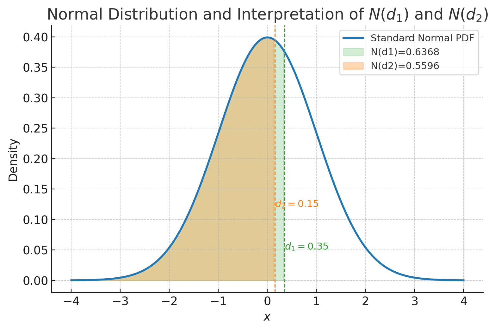

The **Black–Scholes–Merton (BSM) model** provides a continuous-time framework for valuing options and other derivatives.  
It assumes frictionless trading, continuous hedging, and lognormally distributed asset prices.  
The model forms the cornerstone of modern quantitative finance.

## Model Assumptions

1. The underlying asset price $S_t$ follows **geometric Brownian motion**:

   $$
   dS_t = \mu S_t dt + \sigma S_t dW_t,
   $$

   where $\mu$ is the expected return, $\sigma$ the volatility, and $W_t$ a standard Brownian motion.

2. The risk-free rate $r$ and volatility $\sigma$ are constant.  
3. No transaction costs, taxes, or short-selling constraints.  
4. Trading occurs continuously, and borrowing/lending are possible at $r$.  
5. Markets are arbitrage-free and complete.

## Deriving the Black–Scholes–Merton PDE

Let the option value be $V(t,S_t)$.  
By **Itô’s lemma**:

$$
dV = V_t\,dt + V_S\,dS_t + \tfrac{1}{2}V_{SS}(dS_t)^2
    = \left(V_t + \mu S_t V_S + \tfrac{1}{2}\sigma^2 S_t^2 V_{SS}\right)dt
      + \sigma S_t V_S\,dW_t.
$$

We form a self-financing **replicating portfolio** consisting of:

- $\Delta$ units of the underlying asset, and  
- one short option position $(-1)$.

Portfolio value:

$$
\Pi = \Delta S_t - V.
$$

Portfolio dynamics:

$$
d\Pi = \Delta\,dS_t - dV.
$$

Substitute $dS_t$ and $dV$, choose $\Delta = V_S$ to **eliminate the stochastic term** $dW_t$, yielding a riskless portfolio:

$$
d\Pi = (-V_t - \tfrac{1}{2}\sigma^2 S_t^2 V_{SS})dt.
$$

By the **no-arbitrage condition**, the return on the riskless portfolio must equal $r\Pi\,dt$:

$$
-V_t - \tfrac{1}{2}\sigma^2 S_t^2 V_{SS} = r(\Delta S_t - V).
$$

Substitute $\Delta = V_S$ and rearrange:

$$
V_t + \tfrac{1}{2}\sigma^2 S_t^2 V_{SS} + rS_t V_S - rV = 0.
$$

This is the **Black–Scholes–Merton partial differential equation**.

## Boundary Conditions

For a European call option with strike $K$ and maturity $T$:

$$
V(T,S_T) = \max(S_T - K, 0).
$$

For a European put:

$$
V(T,S_T) = \max(K - S_T, 0).
$$

## Solving the PDE (Risk-Neutral Valuation)

Under the **risk-neutral measure** $\mathbb{Q}$, the drift of $S_t$ becomes $(r - q)$:

$$
dS_t = (r - q)S_t dt + \sigma S_t dW_t^{\mathbb{Q}},
$$

where $q$ is the continuous dividend yield.

The discounted price process $e^{-\int_0^t r du} S_t$ is a martingale.  
Hence, by **risk-neutral pricing**:

$$
V(t,S_t) = e^{-r(T-t)}\mathbb{E}^{\mathbb{Q}}\!\left[f(S_T)\,|\,S_t\right].
$$

## Closed-Form Black–Scholes–Merton Formula

For a European call and put:

$$
\begin{aligned}
C &= S_0 e^{-qT} N(d_1) - K e^{-rT} N(d_2), \\\\
P &= K e^{-rT} N(-d_2) - S_0 e^{-qT} N(-d_1),
\end{aligned}
$$

where

$$
d_1 = \frac{\ln(S_0/K) + (r - q + 0.5\sigma^2)T}{\sigma\sqrt{T}}, \qquad
d_2 = d_1 - \sigma\sqrt{T}.
$$

Here, $N(x)$ is the cumulative distribution function of the standard normal distribution.

## Intuition Behind $N(d_1)$ and $N(d_2)$

- $N(d_2)$: risk-neutral probability that the option will expire **in the money** ($S_T > K$).  
- $N(d_1)$: probability-weighted delta — the **present value of expected exercise** under risk-neutral drift.

Thus:

- The first term, $S_0 e^{-qT}N(d_1)$, is the **present value of the expected asset received** upon exercise.  
- The second term, $K e^{-rT}N(d_2)$, is the **present value of the payment** made at exercise.

## Example Calculation

Let:

- $S_0 = 100$, $K = 100$, $r = 5\%$, $q = 2\%$,  
- $\sigma = 20\%$, $T = 1$ year.

Compute:

$$
d_1 = \frac{\ln(1) + (0.05 - 0.02 + 0.5\times0.2^2)}{0.2} = 0.35,
\qquad d_2 = 0.15.
$$

Then:

$$
C = 100 e^{-0.02}(0.6368) - 100 e^{-0.05}(0.5596) = 8.91, \\
P = 100 e^{-0.05}(0.4404) - 100 e^{-0.02}(0.3632) = 6.33.
$$

Hence, the **call price is \$8.91** and **put price is \$6.33**.

## Economic Insights

1. **Volatility ($\sigma$):**  
   Higher volatility increases option value due to convexity of the payoff.

2. **Interest Rate ($r$):**  
   Increases call values (deferring payment) and decreases put values.

3. **Dividends ($q$):**  
   Reduce call prices (less expected growth) and increase puts.

4. **Time to Maturity ($T$):**  
   Generally increases option value — more time, more optionality.

## Visualization: The Black–Scholes World

The BSM framework elegantly connects stochastic calculus, PDEs, and probabilistic valuation.  
Its assumptions may be simplified, but the logic — replication, hedging, and no-arbitrage — underpins all modern pricing theory.

## Summary

- The BSM model arises from continuous-time hedging and no-arbitrage.  
- It yields closed-form prices via risk-neutral expectation.  
- $N(d_1)$ and $N(d_2)$ have clear probabilistic interpretations.  
- The framework extends naturally to Greeks, implied volatility, and exotic options.

Next up: [Greeks and Risk Management](greeks-and-risk-management.md) — understanding sensitivities and hedging strategies.
