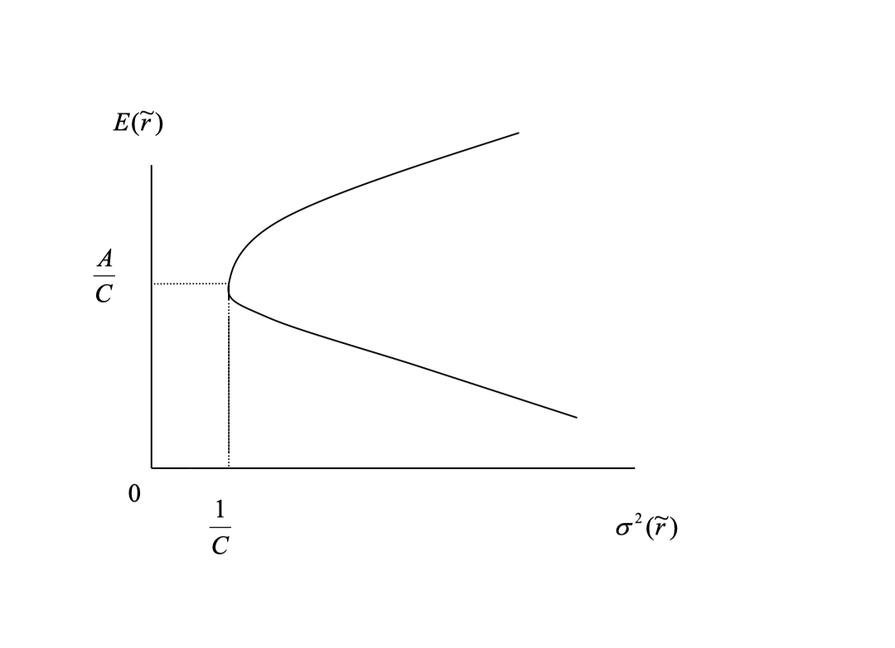
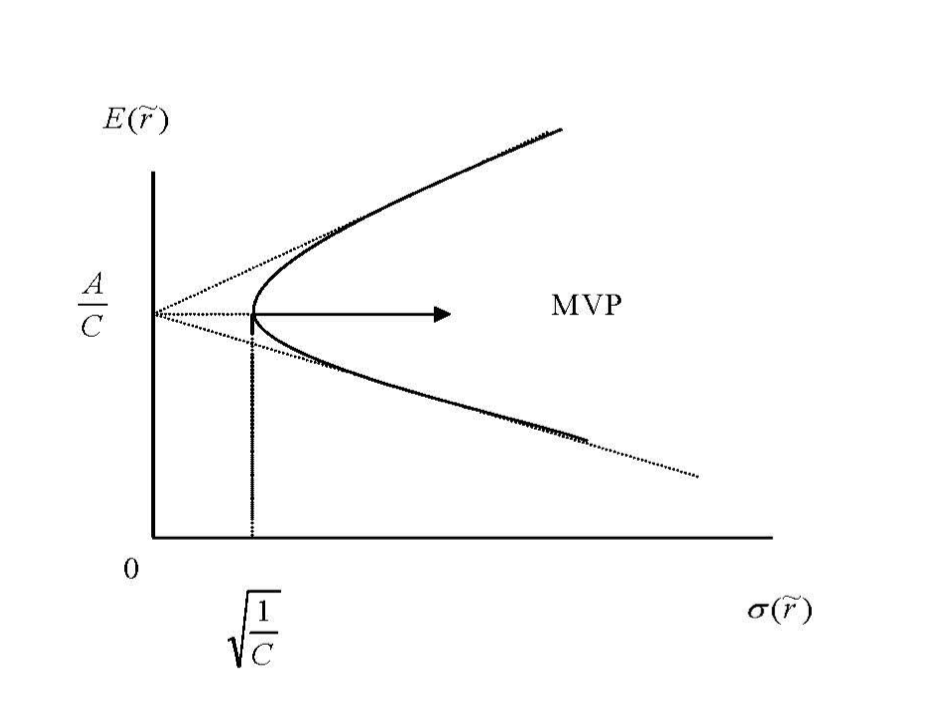

With the solution to the mean-variance optimization problem in hand, we can, for any target expected return $E[\tilde r_p]$, determine the optimal weights $\boldsymbol W^*$, as well as the corresponding variance $\sigma^2_p$ and expected return $E[\tilde r_p]$. This allows us to explore three core features of mean-variance optimization:

- The weight vector $\boldsymbol W^*$ for different target expected returns $E[\tilde r_p]$ (**Two Fund Theorem**)
- The relationship between expected return $E[\tilde r_p]$ and variance $\sigma^2_p$ (**Efficient Frontier**)
- Covariance properties (e.g., with the minimum variance portfolio (MVP), zero covariance portfolios, etc.)

Let's examine each in turn.

## Two Fund Theorem

From the previous section, the optimal weight vector $\boldsymbol W^*$ for a given target expected return $E[\tilde r_p]$ is:

$$
\boldsymbol W^* = \boldsymbol g + \boldsymbol h \cdot E[\tilde r_p],
$$

where:

- $\boldsymbol g = \frac{1}{D} \left( B \cdot \boldsymbol V^{-1} \boldsymbol 1 - A \cdot \boldsymbol V^{-1} \boldsymbol \mu \right)$
- $\boldsymbol h = \frac{1}{D} \left( C \cdot \boldsymbol V^{-1} \boldsymbol \mu - A \cdot \boldsymbol V^{-1} \boldsymbol 1 \right)$

All optimal weights are linear functions of the target expected return $E[\tilde r_p]$. As $E[\tilde r_p]$ varies, so does the optimal weight vector, but all such vectors lie on a straight line in $\mathbb{R}^N$ (the weight space). This means any two optimal portfolios can be combined to construct any other optimal portfolio—a result known as the **Two Fund Theorem**.

**Claim:**

For any two optimal portfolios, any linear combination of them is also an optimal portfolio:

$$
\boldsymbol W^* = \alpha \boldsymbol W^*_1 + (1 - \alpha) \boldsymbol W^*_2, \quad \forall \alpha \in [0, 1]
$$

**Proof:**

Since both are optimal portfolios, we can write:

$$
\begin{align*}
\boldsymbol W^*_1 = \boldsymbol g_1 + \boldsymbol h_1 \cdot E[\tilde r_1], \\
\boldsymbol W^*_2 = \boldsymbol g_2 + \boldsymbol h_2 \cdot E[\tilde r_2],
\end{align*}
$$

where $\boldsymbol g_1, \boldsymbol h_1$ and $\boldsymbol g_2, \boldsymbol h_2$ are the optimal weights for portfolios 1 and 2, respectively. The linear combination is:

$$
\begin{align*}
\boldsymbol W^* &= \alpha \boldsymbol W^*_1 + (1 - \alpha) \boldsymbol W^*_2 \\
&= \alpha (\boldsymbol g_1 + \boldsymbol h_1 E[\tilde r_1]) + (1 - \alpha)(\boldsymbol g_2 + \boldsymbol h_2 E[\tilde r_2]) \\
&= \alpha \boldsymbol g_1 + (1 - \alpha) \boldsymbol g_2 + \alpha \boldsymbol h_1 E[\tilde r_1] + (1 - \alpha) \boldsymbol h_2 E[\tilde r_2] \\
&= \boldsymbol g + \boldsymbol h E[\tilde r_p]
\end{align*}
$$

where:

- $\boldsymbol g = \alpha \boldsymbol g_1 + (1 - \alpha) \boldsymbol g_2$
- $\boldsymbol h = \alpha \boldsymbol h_1 + (1 - \alpha) \boldsymbol h_2$
- $E[\tilde r_p] = \alpha E[\tilde r_1] + (1 - \alpha) E[\tilde r_2]$

Thus, any linear combination of two optimal portfolios is also optimal. This is the **Two Fund Theorem**.

> Note: Optimal portfolios are also called **frontier portfolios** (see the Efficient Frontier section below).

## Efficient Frontier (Without Risk-Free Asset)

Since $\boldsymbol W^*$ traces a straight line in weight space, what does this look like in mean-variance space ($\mu, \sigma^2$) or mean-standard deviation space ($\mu, \sigma$)?

Recall that $\boldsymbol W^*$ is a linear function of $E[\tilde r_p]$, and the portfolio variance $\sigma^2_p = \boldsymbol W_p^T V \boldsymbol W_p$. The relationship between $E[\tilde r_p]$ and $\sigma^2_p$ is:

$$
\begin{align*}
\sigma^2_p &= \boldsymbol W^T \boldsymbol V \boldsymbol W \\
&= (\boldsymbol g + \boldsymbol h E[\tilde r_p])^T \boldsymbol V (\boldsymbol g + \boldsymbol h E[\tilde r_p]) \\
&= \frac{C}{D} [E(\tilde r_p) - \frac{A}{C}]^2 + \frac{1}{C}
\end{align*}
$$

Thus, $\sigma^2_p$ is a quadratic function of $E[\tilde r_p]$. Plotting expected return against variance yields a hyperbola. The minimum variance portfolio (MVP) is the point on the hyperbola with the lowest variance.

### Minimum Variance Portfolio (MVP)

The MVP is the point on the hyperbola with minimum variance. It has expected return $E[\tilde r_{mvp}] = \frac{A}{C}$ and variance $\sigma^2_{mvp} = \frac{1}{C}$.

### Efficient Frontier

According to utility theory, if only the mean and variance of wealth matter, any rational investor would choose the portfolio with the highest expected return for a given level of variance (the top left of the mean-variance space). Thus, only the upper half of the hyperbola is desirable—the **efficient frontier**. In summary:

- **Frontier Portfolios**
  - All points on the hyperbola are frontier portfolios
  - Each is the lowest variance portfolio for a given expected return
  - The frontier is the edge of all feasible portfolios
  - Any two frontier portfolios can be combined to form another frontier portfolio
- **Minimum Variance Portfolio (MVP)**
  - The pivot point of the hyperbola
  - The MVP is the lowest variance portfolio of all portfolios
- **Efficient Frontier**
  - The upper half of the hyperbola
  - Corresponds to $E(\tilde r_p) > E(\tilde r_{mvp}) = \frac{A}{C}$
- **Inefficient Portfolios**
  - The lower half of the hyperbola
  - Corresponds to $E(\tilde r_p) < E(\tilde r_{mvp}) = \frac{A}{C}$
  - Not desirable

### Mean-Standard Deviation Space

The asymptotes are given by:

$$
E[\tilde r_p] = \frac{A}{C} + \sqrt{\frac{D}{C}} \cdot \sigma_p
$$

## Covariance Properties

### Covariance Between Portfolios

The covariance between any two portfolios can be calculated using the covariance matrix $V$:

$$
Cov(\tilde r_p, \tilde r_q) = \boldsymbol W_p^T \boldsymbol V \boldsymbol W_q
$$

where $\boldsymbol W_p$ and $\boldsymbol W_q$ are the weight vectors of the two portfolios.

### Covariance of Frontier Portfolios

Recall the variance of a frontier portfolio:

$$
\sigma^2_p = \frac{C}{D} [E(\tilde r_p) - \frac{A}{C}]^2 + \frac{1}{C}
$$

Similarly, the covariance between any two frontier portfolios is:

$$
Cov(\tilde r_p, \tilde r_q) = \frac{C}{D} [E(\tilde r_p) - \frac{A}{C}] [E(\tilde r_q) - \frac{A}{C}] + \frac{1}{C}
$$

### Covariance with the Minimum Variance Portfolio (MVP)

**Claim:**

The covariance between any portfolio (not necessarily a frontier portfolio) and the MVP is equal to the variance of the MVP:

$$
Cov(\tilde r_p, \tilde r_{mvp}) = \sigma^2_{mvp}
$$

**Proof:**

Consider the portfolio $\alpha \tilde r_p + (1 - \alpha) \tilde r_{mvp}$, where $\alpha$ is a constant. The variance is:

$$
\begin{align*}
Var(\alpha \tilde r_p + (1 - \alpha) \tilde r_{mvp}) &= \alpha^2 Var(\tilde r_p) + (1 - \alpha)^2 Var(\tilde r_{mvp}) + 2\alpha(1 - \alpha) Cov(\tilde r_p, \tilde r_{mvp}) \\
&= \alpha^2 \sigma^2_p + (1 - \alpha)^2 \sigma^2_{mvp} + 2\alpha(1 - \alpha) Cov(\tilde r_p, \tilde r_{mvp})
\end{align*}
$$

The minimum variance is achieved at $\alpha = 0$ (since the MVP is the lowest variance portfolio). The first-order condition (FOC) is:

$$
\begin{align*}
\frac{\partial Var(\alpha \tilde r_p + (1 - \alpha) \tilde r_{mvp})}{\partial \alpha} &= 2\alpha \sigma^2_p + 2(1 - \alpha) \sigma^2_{mvp} + 2\alpha Cov(\tilde r_p, \tilde r_{mvp}) - 2(1 - \alpha) Cov(\tilde r_p, \tilde r_{mvp}) = 0
\end{align*}
$$

Plugging in $\alpha = 0$:

$$
\begin{align*}
2 \sigma^2_{mvp} - 2 Cov(\tilde r_p, \tilde r_{mvp}) = 0 \\
Cov(\tilde r_p, \tilde r_{mvp}) = \sigma^2_{mvp}
\end{align*}
$$

Thus, the covariance between any portfolio and the MVP equals the variance of the MVP.

### Zero Covariance Portfolio

**Claim:**

For any frontier portfolio $p$ (except the MVP), there exists a unique frontier portfolio $zc(p)$ such that the covariance between $p$ and $zc(p)$ is zero.

**Proof:**

Set

$$
Cov(\tilde r_p, \tilde r_q) = \boldsymbol W_p^T \boldsymbol V \boldsymbol W_q
$$

where $\boldsymbol W_p$ and $\boldsymbol W_q$ are the weights of portfolios $p$ and $q$. Using the definitions of $\lambda$ and $\gamma$ for $p$:

$$
\begin{align*}
\lambda &= \frac{C E[\tilde r_p] - A}{D} \\
\gamma &= \frac{B - A E[\tilde r_p]}{D}
\end{align*}
$$

We can show:

$$
E[\tilde r_q] = E[\tilde r_{zc(p)}] + \frac{Cov(\tilde r_p, \tilde r_q)}{\sigma^2_{p}} \{E[\tilde r_p] - E[\tilde r_{zc(p)}]\}
$$

where $\beta_{qp} = \frac{Cov(\tilde r_p, \tilde r_q)}{\sigma^2_{p}}$ is the beta of portfolio $q$ with respect to $p$.

**Interpretation:**

Any portfolio $q$ (not the MVP) can be expressed, explained, or constructed from a frontier portfolio $p$ and its zero covariance portfolio $zc(p)$.

This provides a new perspective for explaining expected returns. In the mean-variance framework, we relate expected return to variance. Now, we can also relate expected return to $\beta_{qp}$: higher beta implies higher expected return.

Later, we will introduce the **Market Portfolio**, a special case where substituting the market portfolio for $p$ yields the **Security Market Line** (SML), which leads to the **Capital Asset Pricing Model** (CAPM). This will be discussed in the next section.

## Conclusion

Key takeaways from this section:

- The optimal weights $\boldsymbol W^*$ are linear functions of the target expected return $E[\tilde r_p]$.
- The portfolio variance $\sigma^2_p$ is a quadratic function of $E[\tilde r_p]$.
- The minimum variance portfolio (MVP) is the point on the hyperbola with the lowest variance.
- The efficient frontier is the upper half of the hyperbola; the lower half is inefficient.
- The covariance between any portfolio and the MVP equals the variance of the MVP.
- The covariance between any two frontier portfolios is given by the covariance matrix $V$.
- For any frontier portfolio $p$ (except the MVP), there exists a unique frontier portfolio $zc(p)$ with zero covariance with $p$.
- Any portfolio $q$ (not the MVP) can be expressed or constructed from a frontier portfolio $p$ and its zero covariance portfolio $zc(p)$.

Next up: [Frontier with Risk-Free Asset](frontier-with-risk-free-asset.md)
