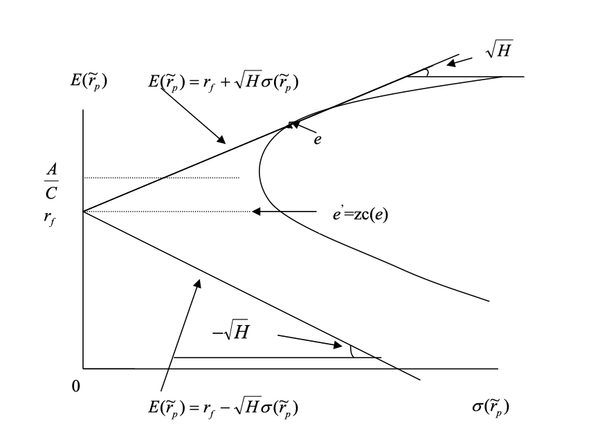

Now we introduce the risk-free asset into mean-variance analysis. The risk-free asset is an asset with a certain return and no risk—typically represented by the return on Treasury bills. While the risk-free asset is a theoretical construct, it is a powerful tool in finance. Its properties are:

1. The return is known with certainty, $r_f$.
2. The variance of its return is zero, $\sigma_{r_f}^2 = 0$.
3. It has zero covariance with all risky assets, $Cov(r_f, r_i) = 0$.

Combining the risk-free asset with any risky asset produces a straight line in mean-variance space. Intuitively, since investors prefer higher returns for a given level of risk (the top-left corner in mean-variance space), the tangent line (if it exists) from the risk-free asset to the risky frontier hyperbola will be the new efficient frontier. This is illustrated below:

In the following sections, we will formally derive the equation for the new efficient frontier with the risk-free asset and show how to find the optimal portfolio.

## Optimization Problem with Risk-Free Asset

**Setup:**

- $r_f$: risk-free rate
- $N$: number of risky assets (total $N+1$ assets including the risk-free asset)
- $W$: $N$-dimensional vector of portfolio weights for risky assets
- $W_{rf}$: weight of the risk-free asset, $W_{rf} = 1 - \sum_{i=1}^N W_i$
- $\mu$: $N$-dimensional vector of expected returns for risky assets

**The problem:**

$$
\begin{align*}
\min_{W} \quad & \frac{1}{2} W^T V W \\
\text{s.t.} \quad & W^T \mu + (1 - W^T \boldsymbol{1}) r_f = E[\tilde r_p]
\end{align*}
$$

> Note: The weight summation constraint is already included in the formulation.

where $E[\tilde r_p]$ is the expected return of the portfolio, and $\boldsymbol{1}$ is a vector of ones. The first term in the objective is the portfolio variance; the constraint ensures the expected return matches the target.

**Lagrangian:**

$$
\mathcal{L}(W, \lambda) = \frac{1}{2} W^T V W + \lambda [E[\tilde r_p] - (W^T \mu + (1 - W^T \boldsymbol{1}) r_f)]
$$

The first-order conditions are:

$$
\begin{align*}
\frac{\partial \mathcal{L}}{\partial W} &= V W - \lambda (\mu - r_f \boldsymbol{1}) = 0 \\
\frac{\partial \mathcal{L}}{\partial \lambda} &= E[\tilde r_p] - (W^T \mu + (1 - W^T \boldsymbol{1}) r_f) = 0
\end{align*}
$$

This system has two unknowns, $W$ and $\lambda$. The solution is:

$$
\begin{align*}
\lambda &= \frac{E[\tilde r_p] - r_f}{(\mu - r_f \boldsymbol{1})^T V^{-1} (\mu - r_f \boldsymbol{1})} \\
W_p &= \lambda V^{-1} (\mu - r_f \boldsymbol{1}) \\
&= \frac{E[\tilde r_p] - r_f}{(\mu - r_f \boldsymbol{1})^T V^{-1} (\mu - r_f \boldsymbol{1})} V^{-1} (\mu - r_f \boldsymbol{1}) \\
&= V^{-1} (\mu - r_f \boldsymbol{1}) \frac{E[\tilde r_p] - r_f}{H}
\end{align*}
$$

where $H = (\mu - r_f \boldsymbol{1})^T V^{-1} (\mu - r_f \boldsymbol{1})$.

## Mean-Variance Relationship and the Capital Market Line

With the optimal portfolio $W_p$, we can compute the expected return and variance:

$$
\begin{align*}
\sigma_p^2 &= W_p^T V W_p \\
&= \frac{[E[\tilde r_p] - r_f]^2}{H}
\end{align*}
$$

Rearranging, we have:

$$
\sigma_p = \frac{E[\tilde r_p] - r_f}{\sqrt{H}}
$$

or equivalently,

$$
E[\tilde r_p] = r_f + \sqrt{H} \cdot \sigma_p
$$

This is a straight line in mean-variance space, known as the **Capital Market Line (CML)**. The slope $\sqrt{H}$ is the Sharpe ratio of the optimal portfolio, and all efficient portfolios on the CML share this Sharpe ratio. The portion of the line above $r_f$ is the efficient frontier; below $r_f$ is inefficient.

## Interaction with the Frontier Without Risk-Free Asset

### Case 1: $r_f < E[\tilde r_{mvp}] = \frac{A}{C}$

- The efficient frontier is the tangent line from $r_f$ to the risky frontier
- The tangent portfolio $e$ is the optimal risky portfolio (zero weight in risk-free asset)
- Portfolios above $e$ require borrowing (negative weight in risk-free asset)
- The zero covariance portfolio $E[\tilde r_{zc(e)}] = r_f$

The tangent portfolio $e$ is especially important; under certain conditions, it becomes the "market portfolio" (discussed in the next section). To find its coordinates, set the slope of the tangent line equal to the derivative of the hyperbola with respect to $\sigma$:

$$
\frac{d E[\tilde r_p]}{d \sigma_p} = \pm \frac{D \sigma_p}{\sqrt{CD\sigma_p^2 - D}}
$$

Since $r_f < \frac{A}{C}$, use the positive sign and set equal to $\sqrt{H}$:

$$
\frac{D \sigma_p}{\sqrt{CD\sigma_p^2 - D}} = \sqrt{H}
$$

Solving gives:

$$
\begin{cases}
\sigma_p = \sqrt{\frac{H}{CH - D}} \\
E[\tilde r_p] = \frac{A}{C} + \frac{D}{C} \sqrt{\frac{1}{CH - D}}
\end{cases}
$$

### Case 2: $r_f > E[\tilde r_{mvp}] = \frac{A}{C}$

The tangent line lies below the efficient frontier and is not optimal.

### Case 3: $r_f = E[\tilde r_{mvp}] = \frac{A}{C}$

In this case:

$$
\begin{align*}
H &= B - 2 A r_f + C r_f^2 \\
&= B - 2 A \frac{A}{C} + C \left(\frac{A}{C}\right)^2 \\
&= \frac{BC - A^2}{C} \\
&= \frac{D}{C}
\end{align*}
$$

Recall the asymptote of the hyperbola:

$$
E[\tilde r_p] = \frac{A}{C} \pm \sqrt{\frac{D}{C}} \sigma_p = r_f \pm \sqrt{H} \sigma_p
$$

Thus, the asymptote is the efficient frontier with the risk-free asset, and the tangent line does not exist:

## Conclusion

Key takeaways:

- The role and properties of the risk-free asset
- The solution to the mean-variance optimization problem with a risk-free asset
- The Capital Market Line (CML) and its interpretation
- The tangent (optimal risky) portfolio
