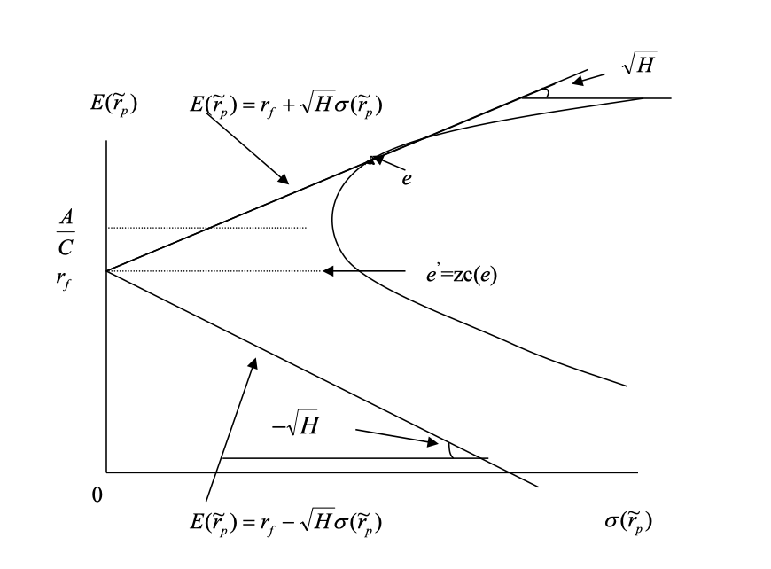

The final topic of the mean-variance analysis is the **Market Portfolio** and **Security Market Line** (SML). Before we dive into the details, let's go back to the investor behavior a little bit to fully understand the concept of market portfolio, since market is the combination of all investors' portfolios.

## Two-Fund Separation

For an individual investor, he or she could achieve the optimal portfolio by combining two funds, it is called two-fund separation.

From previous discussion, we know the two fontier portfolios (with risk-free asset or not) cound generate another frontier portfolio, a investor could achieve any point on the frontier by combining two distinct frontier portfolios, that is a two-fund separation. 

If the frontier does not exist, for example, there is only one risky asset and risk-free, and ($r_f > \mu$), then the investor could only invest in the risk-free asset, since it has zero variance and higher return. This case, all investor would only choose the risk-free asset, that is a One-fund separation. 

Formal difinition of one-fund separation is: A vector of asset returns $\tilde r$ exhibits one-fund separation if there exists a feasible portfolio $\alpha$ such that every risk-averse investor will prefers portfolio $\alpha$ to any other feasible portfolio.

## Market Portfolio

The market portfolio is a theoretical portfolio of the whole market, it could treat as all investors' portfolios combined together. It is a convex combination of all individual portfolios.

In equilibrium, market portfolio's weight times the total wealth of the market is equal to each value of security (company) in the market.

In short:

- In equilibrium, the market portfolio is the market value of all risky assets. (Like a market cap of a company or value weighted index)
- It is also a convex combination of all individual portfolios.

This two properties together could result an interesting result, if the two-fund separation holds, then every investor will only choose efficient portfolios on the efficient frontier, and the market portfolio is also on the efficient frontier, since it is a convex combination of all individual portfolios. In the mean time, the market portfolio is also having zero allocation to the risk-free asset, since it is a combination of all risky assets. Then it must be the tangential point of the efficient frontier and hyperbola!

> Market portfolio is the tangent portfolio $e$, if in equilibrium and the two-fund separation holds.

## Security Market Line

Recall in the discussion of zero-covariance portfolio, we could express any portfolio using a frontier portfolio (except MVP) and its zero-covariance portfolio, using the following equation:

$$
\begin{align*}
E[\tilde r_j] &= E[\tilde r_{zc(p)}] + \beta_{jp} (E[\tilde r_p] - E[\tilde r_{zc(p)}]) \\
\beta_{jp} &= \frac{Cov(\tilde r_j, \tilde r_p)}{Var(\tilde r_p)}
\end{align*}
$$

If we choose market portfolio as the frontier portfolio, its zero-covariance portfolio's expected return $E[\tilde r_{zc(m)}] = r_f$, then we could rewrite the equation as:

$$
\begin{align*}
E[\tilde r_j] &= r_f + \beta_{jm} (E[\tilde r_m] - r_f) \\
&or \\
E[\tilde r_j] - r_f &= \beta_{jm} (E[\tilde r_m] - r_f) \\
\end{align*}
$$

- $E[\tilde r_j] - r_f$: risk premium of the portfolio $j$.
- $E[\tilde r_m] - r_f$: risk premium of the market portfolio.
- $\beta_{jm}$: the sensitivity of the portfolio $j$ to the market portfolio $m$, it is also called the systematic risk of the portfolio, $\beta_{jm} = \frac{Cov(\tilde r_j, \tilde r_m)}{Var(\tilde r_m)}$.

**Interpretation**: 

The risk premium of the portfolio $j$ is determined by how much exposure $\beta_{jm}$ it has to the market portfolio. The more exposure it has, the higher the risk premium, if we plot the risk premium against the beta, we will get a straight line, it is called the Security Market Line (SML):

Although CML and SML essentially come from the same equation, they are different in the following aspects:

- CML is plot on mean-variance space, it is the efficient frontier with risk-free asset.
- SML is plot on mean-beta space, it is the risk premium against beta.

This concept will further lead to the Capital Asset Pricing Model (CAPM), which is a model that describes the relationship between systematic risk ($\beta$) and expected return for assets, particularly stocks. CAPM is widely used in finance for pricing risky securities and generating expected returns for assets given the risk of those assets and cost of capital. We will discuss CAPM and Factor Models in other sections.

## Conclusion

Key takeaways from this section:

- Market portfolio is the tangent portfolio of the efficient frontier and hyperbola.
- Market portfolio is the market value of all risky assets.
- Market portfolio is a convex combination of all individual portfolios.
- Security Market Line (SML) is the risk premium against beta.
- SML is a straight line, it is the relationship between systematic risk and expected return.

