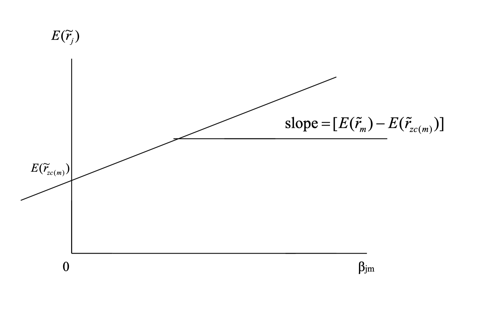

The final topic in mean-variance analysis is the **Market Portfolio** and the **Security Market Line (SML)**. Before diving into the details, let's revisit investor behavior to better understand the concept of the market portfolio, since the market is ultimately the aggregation of all investors' portfolios.

## Two-Fund Separation

An individual investor can achieve an optimal portfolio by combining two funds—this is known as two-fund separation.

From previous discussions, we know that any two frontier portfolios (with or without a risk-free asset) can be combined to generate another frontier portfolio. Thus, an investor can reach any point on the frontier by combining two distinct frontier portfolios. This is the essence of two-fund separation.

If the frontier does not exist (for example, if there is only one risky asset and the risk-free rate $r_f > \mu$), then the investor will only invest in the risk-free asset, as it offers zero variance and a higher return. In this case, all investors would choose the risk-free asset—this is called one-fund separation.

Formally, a vector of asset returns $\tilde r$ exhibits one-fund separation if there exists a feasible portfolio $\alpha$ such that every risk-averse investor prefers $\alpha$ to any other feasible portfolio.

## Market Portfolio

The market portfolio is a theoretical portfolio representing the entire market; it can be viewed as the aggregation of all investors' portfolios. It is a convex combination of all individual portfolios.

In equilibrium, the market portfolio's weights, multiplied by the total market wealth, equal the market value of each security (company) in the market.

In summary:

- In equilibrium, the market portfolio represents the market value of all risky assets (like a market-cap-weighted index).
- It is also a convex combination of all individual portfolios.

These two properties lead to an important result: if two-fund separation holds, every investor will choose efficient portfolios on the efficient frontier, and the market portfolio—being a convex combination of all individual portfolios—must also lie on the efficient frontier. At the same time, the market portfolio has zero allocation to the risk-free asset, as it is composed entirely of risky assets. Therefore, it must be the tangency point between the efficient frontier and the hyperbola.

> The market portfolio is the tangent portfolio $e$ when the market is in equilibrium and two-fund separation holds.

## Security Market Line

Recall from the discussion of zero-covariance portfolios: any portfolio can be expressed using a frontier portfolio (except the MVP) and its zero-covariance portfolio, as follows:

$$
\begin{align*}
E[\tilde r_j] &= E[\tilde r_{zc(p)}] + \beta_{jp} (E[\tilde r_p] - E[\tilde r_{zc(p)}]) \\
\beta_{jp} &= \frac{Cov(\tilde r_j, \tilde r_p)}{Var(\tilde r_p)}
\end{align*}
$$

If we choose the market portfolio as the frontier portfolio, its zero-covariance portfolio has expected return $E[\tilde r_{zc(m)}] = r_f$. We can then rewrite the equation as:

$$
\begin{align*}
E[\tilde r_j] &= r_f + \beta_{jm} (E[\tilde r_m] - r_f) \\
E[\tilde r_j] - r_f &= \beta_{jm} (E[\tilde r_m] - r_f)
\end{align*}
$$

- $E[\tilde r_j] - r_f$: risk premium of portfolio $j$
- $E[\tilde r_m] - r_f$: risk premium of the market portfolio
- $\beta_{jm}$: sensitivity of portfolio $j$ to the market portfolio (systematic risk), $\beta_{jm} = \frac{Cov(\tilde r_j, \tilde r_m)}{Var(\tilde r_m)}$

**Interpretation:**

The risk premium of portfolio $j$ is determined by its exposure $\beta_{jm}$ to the market portfolio. The greater the exposure, the higher the risk premium. If we plot the risk premium against beta, we obtain a straight line—the Security Market Line (SML):

Although the CML and SML are derived from similar equations, they differ in important ways:

- The CML is plotted in mean-variance space and represents the efficient frontier with a risk-free asset.
- The SML is plotted in mean-beta space and shows the relationship between risk premium and beta.

This concept leads directly to the Capital Asset Pricing Model (CAPM), which describes the relationship between systematic risk ($\beta$) and expected return for assets, especially stocks. CAPM is widely used in finance for pricing risky securities and estimating expected returns given an asset's risk and the cost of capital. CAPM and factor models are discussed in detail in other sections.

## Conclusion

Key takeaways from this section:

- The market portfolio is the tangency point of the efficient frontier and the hyperbola.
- The market portfolio represents the market value of all risky assets.
- The market portfolio is a convex combination of all individual portfolios.
- The Security Market Line (SML) shows the relationship between risk premium and beta.
- The SML is a straight line, representing the link between systematic risk and expected return.
