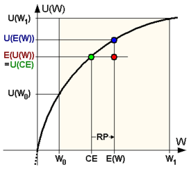
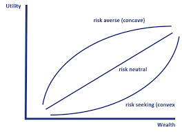

## Utility Function

Under the classic economics assumption of rationality, everyone should act to maximize their "interest". For any decision making activity including investing, if we could have a method to measure the "interest" of a decision, we could use simple optimization methods like calculus to find the best decision. 

We can use the concept of utility to measure the "interest" of a decision. Utility is a measure of the satisfaction or benefit that an individual derives from consuming goods and services. The utility function is a mathematical representation of this concept, which assigns a numerical value to each possible outcome based on the individual's preferences.

Example:

$$
u(W) = \ln(W)
$$

Where $W$ is the wealth of the individual. The logical assumption should be that, the more wealth you have, the more utility you have. A rational person should always choose the option that maximizes their expectated utility, therefore:

$$
\text{maximize } E[u(W)]
$$

Utility functions are "imaginary" functions, it not only could have different forms, every individual could have different utility functions. The utility function is a subjective measure of satisfaction, and it can vary from person to person.

> Property one: increasing function <=> First derivative is positive

## Risk Aversion

Risk aversion is a concept in economics and finance that describes an individual's preference for certainty over uncertainty. Imaging following "fair" gamble:

$$
\begin{align*}
\text{Gamble} & : \text{Win } 100 \text{ with probability } 0.5 \\
& \text{Lose } 100 \text{ with probability } 0.5
\end{align*}
$$

> A "fair" game is one where the expected value of the gamble is zero.

Writing the gamble in variable $\tilde x$ form (Binomial variable):

$$
\tilde x = \begin{cases}
100 & \text{with probability } 0.5 \\
-100 & \text{with probability } 0.5
\end{cases}
$$

> In this article, we will use the notation $\tilde x$ to denote a random variable, and $x$ to denote a deterministic value.

Suppose you have initial wealth $W_0 = 1000$, then the expected wealth after the gamble is:

$$
E[W] = 0.5 \cdot (W_0 + 100) + 0.5 \cdot (W_0 - 100) = W_0
$$

If you are **unwilling** to accept the gamble, then you are **risk averse**. You should have higher utility with certainty than with the gamble, then:

$$
u(W_0) > E[u(W_0 +\tilde x)]
$$

We could easily quantify the risk aversion by calculating how much wealth you are willing to give up to avoid the gamble. The amount of wealth you are willing to give up is the **risk premium**, after paying the risk premium, the remaining wealth is called the **certainty equivalent**.

$$
u(W_0) > u(W_0 - \pi) = E[u(W_0 + \tilde x)]
$$

where: 

- $\pi$ is the risk premium
- $W_0 - \pi$ is the certainty equivalent

Source: [Risk Aversion](https://en.wikipedia.org/wiki/Risk_aversion)

With Jensen's inequality, we can prove that a risk averse person will always have a **concave** utility function.

Source: [Certainty Equivalent](https://breakingdownfinance.com/finance-topics/behavioural-finance/certainty-equivalent/)

> Property two: risk aversion <=> concave utilty function <=> Second derivative is negative

## Summary

- Utility function is a subjective measure of satisfaction
- Every individual could have different utility functions
- Utility function is a increasing function <=> $u'(x) > 0$
- Risk averse individual's utility function is a concave function <=> $u''(x) < 0$

