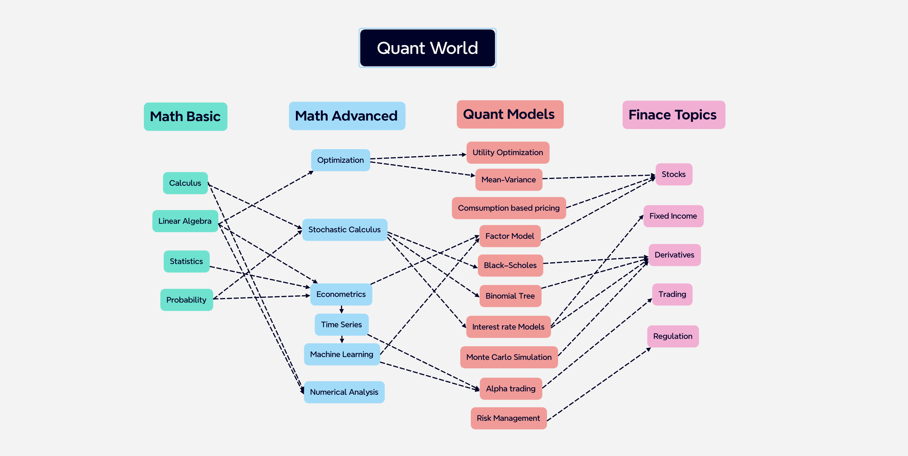

This blog is a collection of quant skills, finance knowledge, programming tips, and personal experiences. Aimed at quant enthusiasts, finance professionals, and anyone interested in the world of finance, BagelQuant offers a unique perspective on the industry. More about me can be found [here](https://bagelquant.github.io/about-me/).

## Topic lists

| **Math Basics**     | **Math Advanced**                                                                 | **Quant Models**                              | **Finance**         |
|---------------------|-----------------------------------------------------------------------------------|-----------------------------------------------|---------------------|
| Linear Algebra       | [Optimization](_pages/math-advanced/optimization/optimization.md)               | [Utility Theory](_pages/quant-models/utility-theory/utility-theory.md)                                 | Basic Finance       |
| [Calculus](_pages/math-basic/calculus/calculus.md)             | Stochastic Calculus                                                              | [Mean-Variance Optimization (Modern Portfolio Theory)](_pages/quant-models/mean-variance/mean-variance.md) | Stocks              |
| [Probability](_pages/math-basic/probability/probability.md)          | [Econometrics](_pages/math-advanced/econometrics/econometrics.md)               | [Consumption-based Asset Pricing](_pages/quant-models/consumption-based-pricing/consumption-based-pricing.md)                | Fixed Income        |
| Statistics           | Financial Time Series                                                            | [Factor Models](_pages/quant-models/factor-models/factor-models.md)                                  | [Derivatives](_pages/finance/derivatives/derivatives.md)         |
|                     | Machine Learning                                                                 | Black-Scholes Model                            | Regulation          |
|                     |                                                                                   | Binomial Tree                                  |                     |
|                     |                                                                                   | Interest Rate Models                           |                     |
|                     |                                                                                   | Monte Carlo Simulation                         |                     |
|                     |                                                                                   | Algorithmic Trading                            |                     |
|                     |                                                                                   | Risk Management                                |                     |
