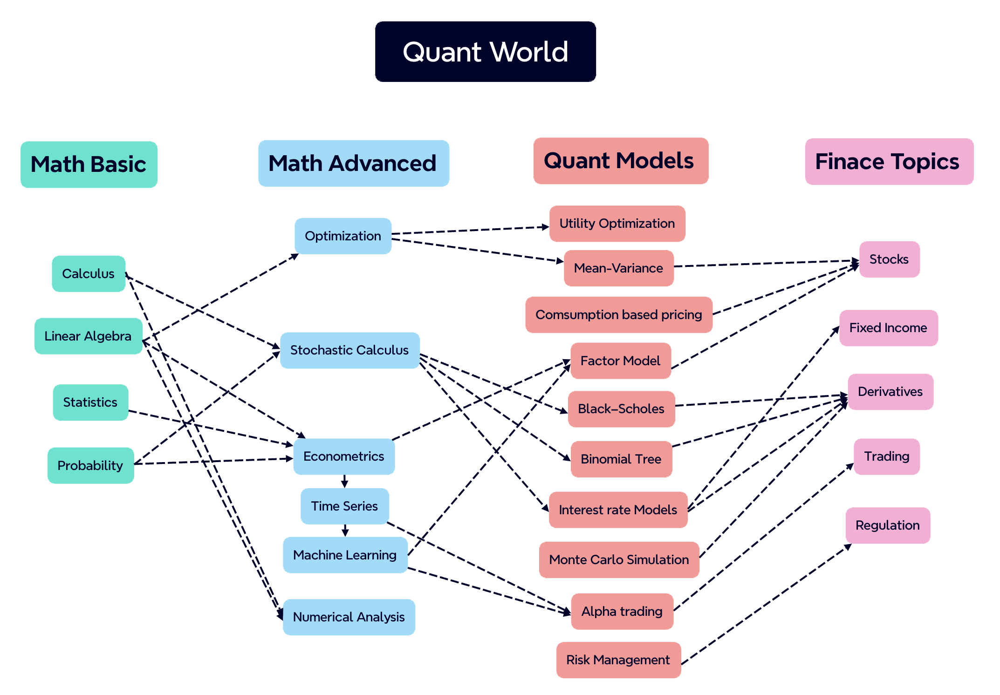

## Welcome to BagelQuant!

This blog is a collection of quant skills, finance knowledge, programming tips, and personal experiences. 
Aimed at quant enthusiasts, finance professionals, and anyone interested in the world of finance, 
BagelQuant offers a unique perspective on the industry. Here is a map of the quant world:

## Topic lists:

Math Basics:

- Linear Algebra
- Calculus
- Probability
- Statistics

Math Advanced:

- [Optimization](_pages/math_advanced/optimization/optimization.md)
- Stochastic Calculus
- [Econometrics](_pages/math_advanced/econometrics/econometrics.md)
- Financial Time Series
- Machine Learning

Quant Models:

- Utility Theory
- Mean-Variance Optimization(Modern Portfolio Theory)
- Consumption-based Asset Pricing
- Factor Models
- Black-Scholes Model
- Binomial Tree
- Interest Rate Models
- Monte Carlo Simulation
- Algorithmic Trading
- Risk Management

