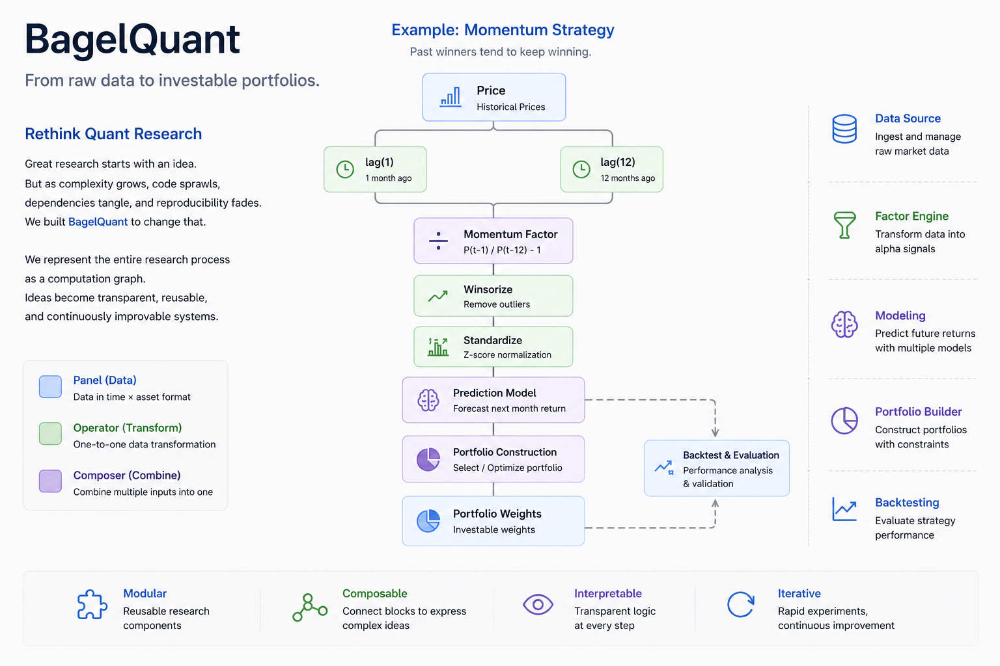

# BagelQuant

## Rethinking Quant Research

Most quantitative research does not start with a model. It starts with an idea.

- Maybe: Value stocks outperform over the long run.
- Maybe: Analyst revisions anticipate future returns.
- Or maybe it is just a simple question:

What happens if we combine these pieces of information together?

But as research grows, problems begin to appear, more scripts, more dependencies. Experiments become harder to reproduce. Models turn into black boxes. Eventually, we lose the most important thing in research:

**Understanding the process.**

BagelQuant aims to rethink how research is built.

## Express Investment Ideas with Graphs

In BagelQuant, every research workflow is represented as a computation **graph**.

- Data flows.
- Nodes transform.
- Results combine.

Eventually forming an investable portfolio.

For example, consider a simple momentum strategy. We assume: Stocks that performed better in the past tend to continue performing well.

In traditional research, this logic may end up scattered across dozens of scripts and multiple systems.

With Graph, the same idea becomes:



Each node represents a single research step. Nodes can be replaced, combined, and reused.

You can replace momentum with value. Replace linear models with neural networks. Replace Top N selection with constrained portfolio optimization. While keeping the entire research process transparent.

Research is no longer a collection of scripts. It becomes a system that can continuously evolve.

## More Than a Framework

BagelQuant is also a continuously growing knowledge base.

- From mathematics to financial theory.
- From factor research to predictive modeling.
- From portfolio construction to validation under real-world trading constraints.

The goal is to help researchers understand:

**How investment ideas become investable portfolios.**

## Start Here

- [Quick Start](/content/en/quick-start/)
- [Learn](/content/en/learn/)
- [Research](/content/en/research/)
- [Documentation](/content/en/documentation/)

## Future Applications

The future BagelQuant App will provide a graphical interface for research. Build complete workflows by connecting nodes:

```text
Factor → Model → Portfolio → Backtest
```

Without rebuilding the entire research system.

## About Me

BagelQuant is maintained by [Yanzhong (Eric) Huang](about-me.md).

Quantitative researcher focused on factor research, predictive modeling, portfolio construction, and research infrastructure.

Building systems that make quantitative research composable, reproducible, and continuously evolvable.